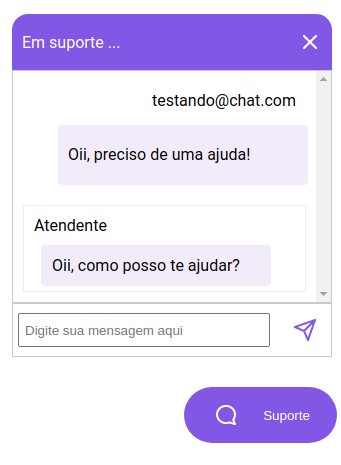

# Projeto Chat - #NLW5

Este projeto foi desenvolvido através Next Level Week 5 - da [RocketSeat](https://rocketseat.com.br/)

## Chat

O objetivo deste projeto é uma aplicação em NodeJS utilizando Websocket para um chat online.

Possibilitando uma comunicação através de um botão de Suporte. Onde o cliente informa o que deseja, insere seu e-mail e solicita o auxilio ao admin.

O admin pode conversar com mais de um cliente através da mesma interface.

A comunicação é instântanea e as imagens da interface podem ser vistas abaixo:




# Tecnologias Utilizadas

- NodeJS
- Express
- TypeScript
- ORM Typeorm
- Yarn
- Websocket
- Migrations

# Como executar este projeto

```
yarn install
```

# Como rodar esta aplicação

```
yarn dev
```